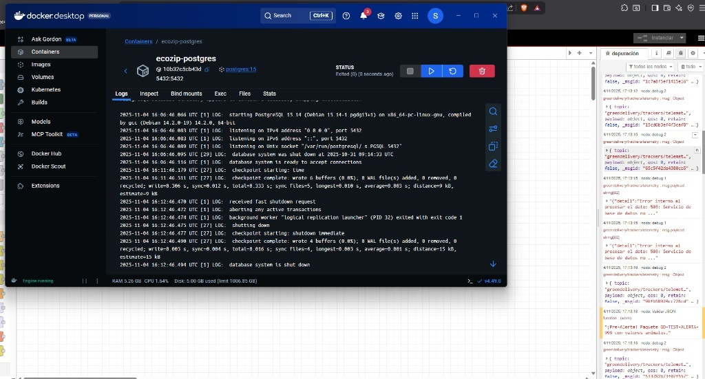
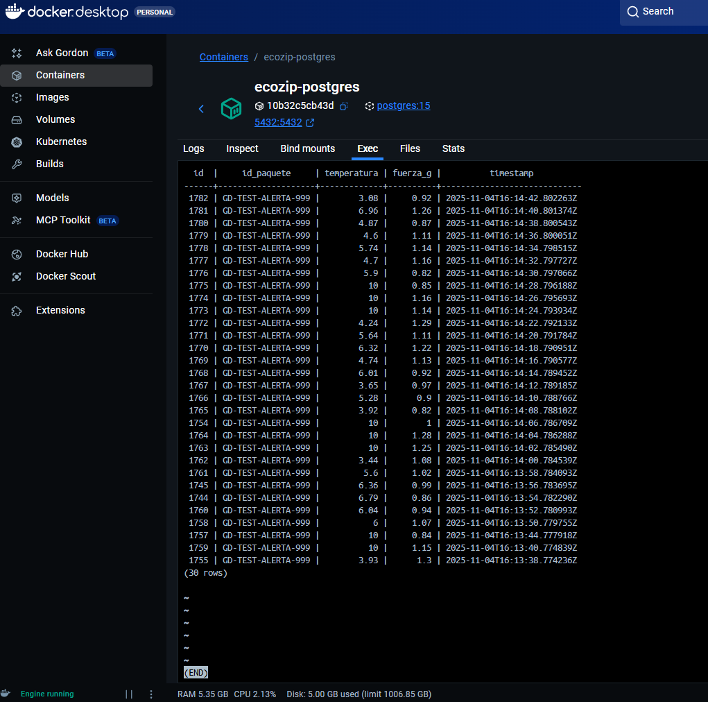

# Capítulo 5: "Batalla Final" - Prueba de Disponibilidad (Paso 3)

Este documento demuestra la resiliencia del pipeline (Paso 3: Disponibilidad) y el éxito de la "Batalla Final".

## 1. El Diseño de Reintentos

La resiliencia se implementó en el flujo de Node-RED (`flows.json` del Cap. 3) usando un bucle de reintentos asíncrono.

* Un nodo **`catch`** captura cualquier error del nodo `[Llamar API Ingesta]`.
* Un nodo **`delay`** espera 5 segundos.
* El flujo reintenta la llamada a la API, asegurando que ningún dato se pierda.

## 2. La "Batalla Final": Simulación de Fallo

Se ejecutó la prueba de resiliencia parando el contenedor `ecozip-postgres`.

### Resultado del Fallo:

Inmediatamente, Node-RED detectó que la API no podía conectarse. El nodo `catch` se activó y el sistema comenzó a registrar los errores (`Error interno...`) en lugar de perder los datos.

## 3. Verificación de la Recuperación

Se restauró el contenedor `ecozip-postgres`. Node-RED procesó la ráfaga de mensajes "atascados" en el bucle.

### Evidencia Forense (Prueba Superada):

La consulta `SELECT` a la base de datos *después* de la recuperación demuestra que **no hay huecos en los timestamps**. Todos los datos que se enviaron durante la caída se guardaron correctamente. **No se ha perdido ni un solo dato.**

